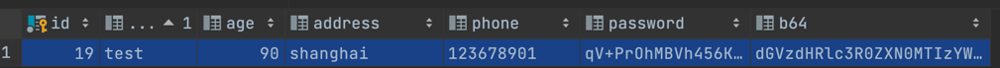

# Mybatis 字段转换器

极小侵入业务代码，只需在Entity类字段上注解`@Convert`，就可实现字段数据与数据库存储直接的互相转换。
可用于字段透明加密、编码、转换、格式化等场景。

## 示例

*持久化类*

```java
public class User {

  @Convert(value = AesConverter.class, param = "${props:aes.key:123456}")
  private String password;

  @Convert(Base64Converter.class)
  private String b64;
}
```

*读写该类*

```java
public class UserTest {

  public static void main(String[] args) throws IOException {
    String resource = "com/wpp/fc/samples/mybatis-config.xml";
    InputStream inputStream = Resources.getResourceAsStream(resource);
    SqlSessionFactory sqlSessionFactory = new SqlSessionFactoryBuilder().build(inputStream);
    SqlSession sqlSession = sqlSessionFactory.openSession(true);

    UserMapper mapper = sqlSession.getMapper(UserMapper.class);
    User user = createUser();
    mapper.save(user);

    List<User> list = mapper.list();
    for (User u : list) {
      System.out.println(u);
    }

    sqlSession.close();
  }

  private static User createUser() {
    User user = new User();
    user.setName("test");
    user.setAge(90);
    user.setPhone("123678901");
    user.setPassword("testtest");
    user.setAddress("shanghai");
    user.setB64("testtesttest123ab");
    return user;
  }

}
```

*数据库存储*

